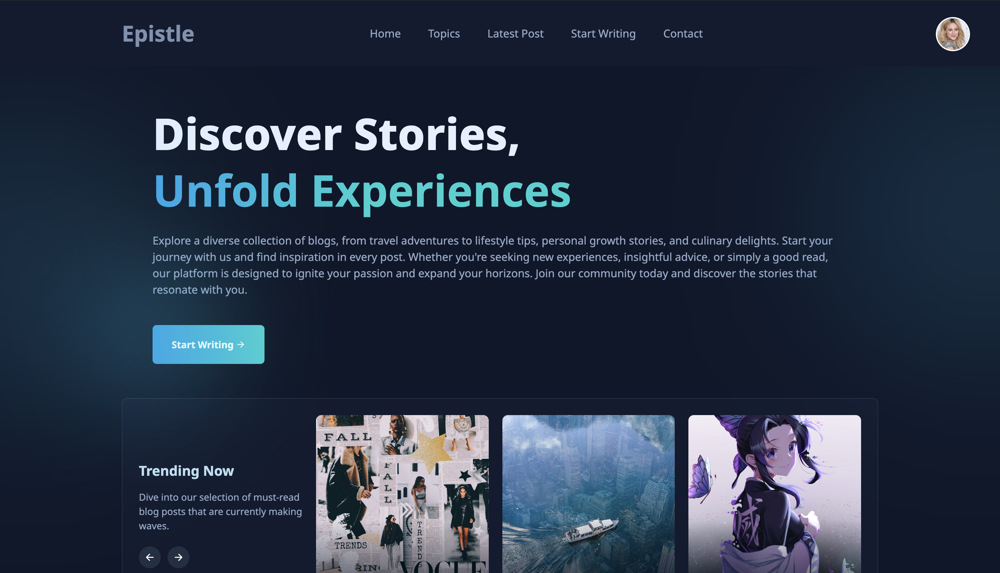

# Epistle



_Epistle_ is a full-stack blogging platform built with React on the frontend and Django on the backend. This project offers a comprehensive blogging experience with user authentication, rich-text editing for posts, tag filtering, and a user profile section. It's designed to provide an intuitive and seamless interface for both bloggers and readers.

## Features

- **User Authentication:** Secure sign-up, login, and logout functionality.
- **Rich-Text Editor:** Create and format blog posts with a feature-rich editor.
- **Tag Filtering:** Easily filter blog posts by tags for better content discovery.
- **User Profiles:** Each user has a customizable profile.
- **Responsive Design:** Fully responsive design to ensure a great experience on all devices.
- **CRUD Functionalities:** Create, Read, Update, and Delete blog posts with ease.

## Installation

To run this project locally, follow these steps:

### Prerequisites

- Python 3.x
- Django
- Node.js
- npm or Yarn

### Backend Setup (Django)

1. Clone the repository:

   ```bash
   git clone https://github.com/yourusername/epistle.git
   cd epistle
   ```

2. Set up a virtual environment:

   ```bash
   python3 -m venv venv
   source venv/bin/activate  # On Windows use `venv\Scripts\activate`
   ```

3. Install the required Python packages:

   ```bash
   pip install -r requirements.txt
   ```

4. Run the migrations:

   ```bash
   python manage.py migrate
   ```

5. Create a superuser to access the admin panel:

   ```bash
   python manage.py createsuperuser
   ```

6. Start the Django development server:
   ```bash
   python manage.py runserver
   ```

### Frontend Setup (React)

1. Navigate to the `frontend` directory:

   ```bash
   cd frontend
   ```

2. Install the required npm packages:

   ```bash
   npm install  # or yarn install
   ```

3. Start the React development server:
   ```bash
   npm start  # or yarn start
   ```

## Usage

1. Open your browser and navigate to `http://localhost:8000` to access the Django backend.
2. Access the React frontend by navigating to `http://localhost:3000`.
3. Use the superuser credentials to log in to the Django admin panel at `http://localhost:8000/admin/`.
4. Create and manage blog posts, tags, and user profiles directly from the admin panel or the frontend interface.

## Contributing

Contributions are welcome! Please fork this repository and submit a pull request for any enhancements or bug fixes.
